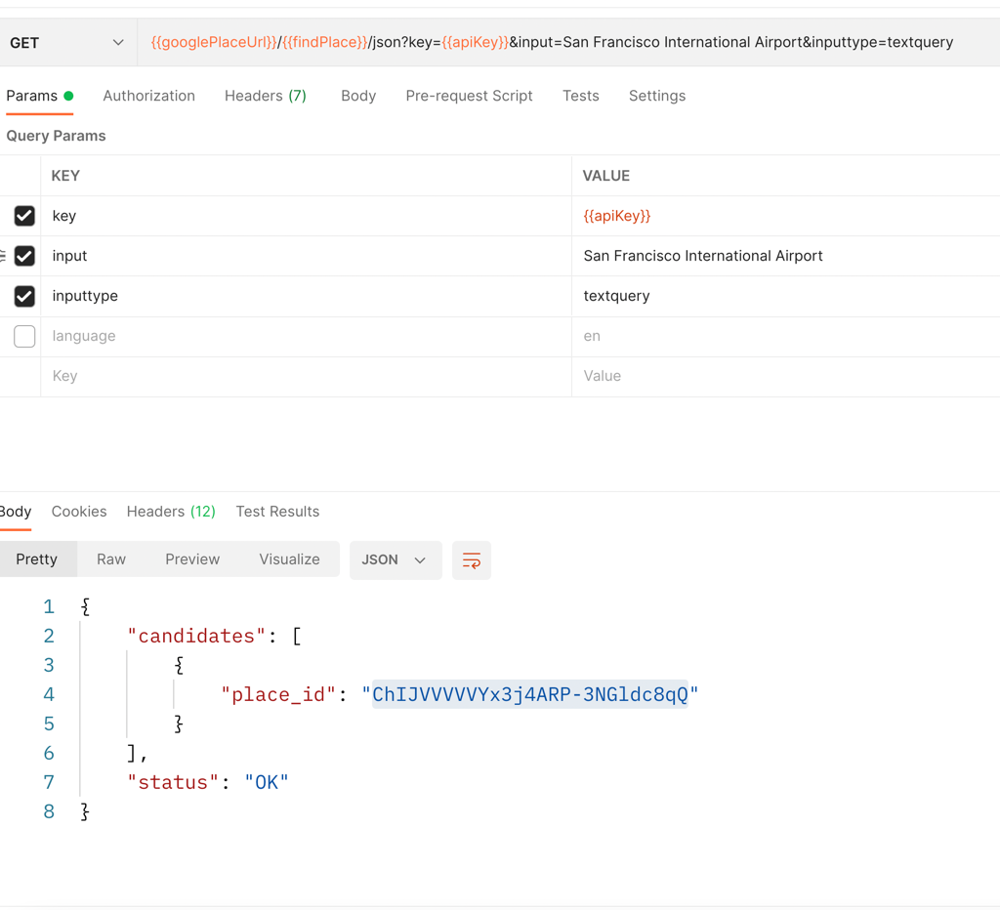

- Create a collection, run the request, receive the response

- Create Environment Variables
- Prepare valid/invalid test data to run against the requests

for example:
- valid: ?input=San Francisco International Airport
- invalid: special characters or missing API key
